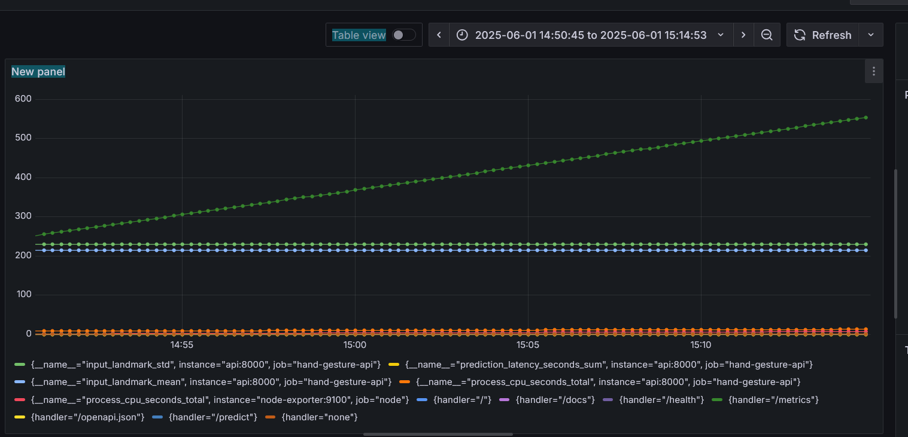

# ✋ Hand Gesture Recognition - MLOps Final Project

This project demonstrates a complete MLOps pipeline for deploying a hand gesture recognition model using FastAPI, Docker, Prometheus, and Grafana. It includes model serving, unit testing, containerization, monitoring, and deployment to AWS EC2.

---

## 🔧 Installation

Install the required Python dependencies:

```bash
pip install -r requirements.txt
```

---

## 🚀 Model Serving (API)

We serve the trained hand gesture classifier using **FastAPI**.

Run the API:

```bash
python -m app.main
```

### 🎯 Gesture Mapping

The trained model originally predicted:
```python
gesture_labels = {
    0: "call", 1: "dislike", 2: "fist", 3: "four", 4: "like",
    5: "mute", 6: "ok", 7: "one", 8: "palm", 9: "peace",
    10: "peace inv.", 11: "rock", 12: "stop", 13: "stop inv.",
    14: "three", 15: "three 2", 16: "two up", 17: "two up inv."
}
```

We map these to simpler directional gestures expected by the frontend:
```python
expected_gestures = ["up", "down", "left", "right", "null"]

"like" ---> "up"
"dislike" ---> "down"
"palm" ---> "left"
"ok" ---> "right"
"others" ---> "null"
```

---

## 🧪 Unit Testing

To run tests:

```bash
pytest
```

All tests are located in the `tests/` folder.

---

## 📦 Containerization

### Docker

Build the image:

```bash
docker build -t hand-gesture-api .
```

Run the container:

```bash
docker run -d -p 8000:8000 hand-gesture-api
```

### Docker Compose

We use Docker Compose to manage the API, Prometheus, and Grafana.

Run all services:

```bash
docker-compose up --build
```

---

## 📈 Monitoring with Prometheus + Grafana

We collect and visualize key metrics related to the model, data, and server performance.

### Metrics Monitored

| Metric Name                | Type           | Reason for Choosing                                                                 |
|---------------------------|----------------|--------------------------------------------------------------------------------------|
| `prediction_latency_seconds` | Model-related  | Measures how long the model takes to make a prediction. Detects slowdowns or model drift. |
| `input_landmark_mean`       | Data-related   | Helps verify if input hand landmarks are centered or normalized. Anomalies indicate frontend or data pipeline issues. |
| `input_landmark_std`        | Data-related   | Indicates how spread out the landmarks are. A very low std may indicate a stuck hand, poor detection, or invalid input. |
| `node_cpu_seconds_total` (via Node Exporter) | System-related | Monitors CPU usage on the EC2 instance. Detects system overloads or inefficient code under traffic. |

### Grafana Dashboard

> 

---

## ☁️ Deployment (CI/CD + AWS)

We deploy the application using:

- **GitHub Actions** to build & push Docker image to ECR
- **EC2 instance** to run the container via SSH

**CI/CD Workflow Includes:**

1. Checkout repo
2. Run tests
3. Build Docker image
4. Push to ECR
5. SSH into EC2 & run container from ECR

---

## 📁 Project Structure

```
.
├── app/
│   ├── main.py              # FastAPI entry point
│   ├── model.pkl            # Saved hand gesture model
│   └── utils.py             # Normalization & mapping functions
├── tests/
│   └── test_api.py          # Unit tests
├── Dockerfile
├── docker-compose.yml
├── requirements.txt
├── prometheus.yml
└── README.md
```

---

## ✅ Final Notes

- Make sure to open port 80 in the EC2 security group.
- Use the EC2 Public IP to test the API from the frontend:
  
  ```
  http://<EC2_PUBLIC_IP>/
  ```
